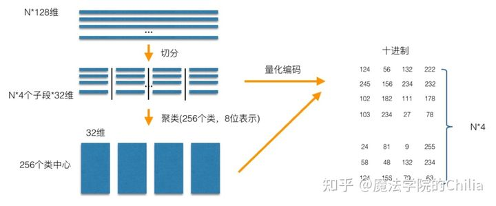
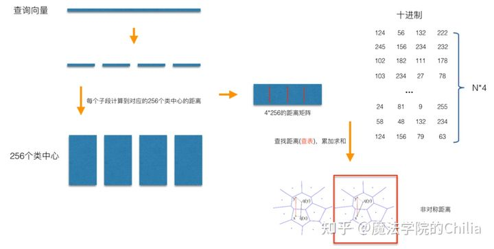
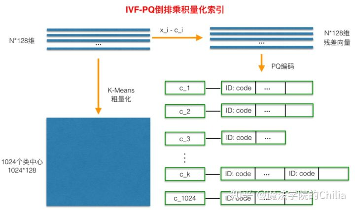

# 乘积量化 Product Quantization

如何在高维空间下检索相似的向量。通常从以下两个方面提升：

- 减少候选集数量
- 降低单个向量的计算复杂度

## 主要思想

朴素的PQ算法通过降低单个向量的计算复杂度（方式2）来减少检索时间复杂度。

具体的算法流程可以参考：[搜索召回 | Facebook: 亿级向量相似度检索库Faiss原理+应用 - 知乎 (zhihu.com)](https://zhuanlan.zhihu.com/p/432317877)。

训练流程：

- 高维空间划分；
- 子空间特征聚类，得到簇心向量；
- 簇心id量化原始向量；

查询流程：

- 查询向量划分；
- 预计算查询的M个子向量与簇心之间的距离；
- 遍历向量空间，比较子向量和各id化向量之间的距离；

算法的提速是通过预处理簇心之间的距离实现的，缺点也很明显：比较空间依旧是整个向量空间。

## 优化 IVF-PQ

IVF-PQ在PQ基础上，预先在全向量空间中聚类得到若干簇中心，当查询向量来的时候，只需要选择距离最近topN个簇中的向量进行计算，然后计算过程同PQ。第一步聚类+topN，减少了比较的向量空间大小。
